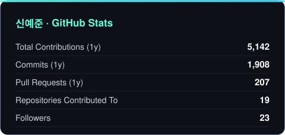
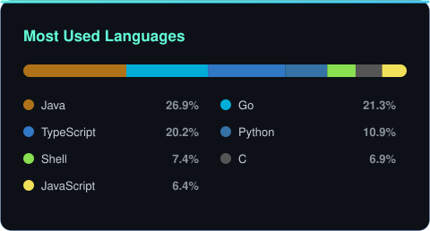

<div align="center">

<a href="https://www.linkedin.com/in/yejun-shin"></a>
<a href="mailto:wns1826@naver.com"></a>
<a href="https://github.com/yessjun"></a>


</div>

<br/>

## 👋 About

**부산대학교 정보컴퓨터공학부**를 마치고, 실제 사용자가 매일 쓰는 **클라우드·배포 플랫폼**을 설계하고 운영합니다.

- 🏗️ 부산대학교 클라우드 플랫폼 **`Pickle`** 과 SW프로젝트관리시스템 **`Opus`** 를 기획부터 운영까지 총괄했고, 지금까지 교내에서 서비스 중입니다.
- ⚡ SW마에스트로 16기에서 **Knative 기반 scale-to-zero 배포 플랫폼 `LaunchPad`** 를 만들었습니다.
- 🛡️ **BoB 8기 취약점 분석 트랙**을 수료하고, **공군사관학교**에서 망분리 환경 관제와 엔드포인트 보안, 침해사고 대응을 했습니다.
- 🧩 온프레미스 인프라 자동화와 서버 운영을 주로 다룹니다.

```yaml
name:     신예준 (Yejun Shin)
role:     Platform Engineer
edu:      Pusan National University, CSE
programs: [ SW Maestro 16th, BoB 8th (Vulnerability Analysis), Codyssey AI 2nd ]
focus:    [ Proxmox VE, Spring Boot, Go, PostgreSQL, Linux ]
running:  [ pickle.pusan.ac.kr, opus.pusan.ac.kr ]
```

<br/>

## 🚀 Featured Projects

<table>
<tr>
<td width="50%" valign="top">

### 🥒 Pickle

부산대학교 구성원이 쓰는 클라우드 플랫폼입니다. 신청, 승인, 자동 생성, 회수로 이어지는 흐름을 만들었습니다.
처음엔 Proxmox VE 위의 VM만 다뤘는데 지금은 LLM API 게이트웨이와 GPU 컨테이너까지 제공 리소스를 넓히는 중입니다.
접근 쪽은 SSH 게이트웨이, 웹 터미널, 도메인 HTTPS 공개, 포트 포워딩을 붙였습니다.

`Spring Boot` `Go` `PostgreSQL` `Proxmox VE` `nftables`

[](https://pickle.pusan.ac.kr)
[](https://github.com/orgs/PNUops/repositories?q=pickle)

</td>
<td width="50%" valign="top">

### 🚀 LaunchPad

SW마에스트로 16기 프로젝트. 코드를 올리면 이미지 빌드부터 실행까지 알아서 되는 배포 플랫폼입니다.
Knative로 요청이 없을 때 Pod을 0까지 내리고, 네트워크 스토리지로 볼륨을 공유해서 데이터베이스가 붙은
서비스도 scale-to-zero가 되게 만들었습니다. GitHub Webhook을 물려 푸시하면 바로 배포됩니다.

`Kubernetes` `Knative` `Docker` `GitHub Webhook`

[](https://www.swmaestro.org)

</td>
</tr>
<tr>
<td width="50%" valign="top">

### 📊 Opus (SW프로젝트관리시스템)

부산대학교 SW교육센터에서 프로젝트장을 맡아 기획부터 운영까지 했습니다.
시스템을 실제로 쓰게 될 학과 조교, 사업단 연구원과 이야기하면서 필요한 기능을 정리하고
무엇부터 만들지 순서를 잡았습니다. 지금까지 학부에서 쓰고 있습니다.

`Spring` `MySQL` `3-tier`

[](https://opus.pusan.ac.kr)
[](https://github.com/orgs/PNUops/repositories?q=opus)

</td>
<td width="50%" valign="top">

### 🛡️ Security Research

직접 찾아 제보한 것들입니다.

- 글로벌 게임사 클라이언트 인증 취약점 (버그바운티 $2,000)
- 글로벌 게임사 한국 모바일 스토어 부정 재화 취득 취약점
- 국립대학교 통합포털 인증 취약점 (KVE-2018-2164)

`BoB 8th` `Vulnerability Analysis`

</td>
</tr>
</table>

<br/>

## 🛠️ Tech Stack

<div align="center">

**Languages**


**Backend**


**Infrastructure**


**Security & Network**


</div>

<br/>

## 📈 GitHub Stats

<div align="center">





</div>

<br/>

## 🏆 Awards & Experience

**Highlights**

| 연도 | 수상 | 시상 |
|:---|:---|:---|
| 2024 | 제11회 대한민국 SW융합 해커톤 **대상** | 과학기술정보통신부 장관 |
| 2024 | 캡스톤디자인(졸업과제) **금상** | 부산대학교 정보의생명공학대학장 |
| 2023 | SW Innovation 창업 해커톤 **최우수상** | 부산대학교 총장 |
| 2022 | 공사 창업경진대회 **우수상** | 공군사관학교장 |
| 2019 | SEOUL 미세먼지 해커톤 **우수상** | 서울기술연구원장 |
| 2017 | 한국정보올림피아드 공모부문 **은상** | 한국정보화진흥원장 |

<details>
<summary><b>📂 전체 수상 이력 펼치기 (30+)</b></summary>

<br/>

**대학 교외활동**

| 날짜 | 대회 | 상 |
|:---|:---|:---|
| 2025.08.31 | 제12회 대한민국 SW융합 해커톤 (지정과제2) | 우수상 · 충청북도지사 |
| 2024.08.25 | 제11회 대한민국 SW융합 해커톤 (지정과제1) | 대상 · 과학기술정보통신부 장관 |
| 2024.08.14 | 제1회 전국대학 소프트웨어 성과 공유 포럼 | 우수상 · 동아대학교 소프트웨어혁신센터장 |
| 2023.08.19 | 2023 모형차 자율주행 경진대회 | 대상 · 한동대학교 SW중심대학지원사업단장 |
| 2022.05.02 | 공사 창업경진대회 | 우수상 · 공군사관학교장 |
| 2021.11.25 | 2021년 정보통신경연대회 | 특별상 · 공군 정보통신학교장 |
| 2020.09.18 | 2020 부산 코딩경진대회 | 동상 · 부산소프트웨어중심대학협의회장 |
| 2019.06.27 | 2019 SEOUL 미세먼지 해커톤 | 우수상 · 서울기술연구원장 |

**부산대학교**

| 날짜 | 대회 | 상 |
|:---|:---|:---|
| 2025.10.01 | 2025 CSE TECHWEEK 프로그래밍 경진대회 | 4학년 2등 · 정보컴퓨터공학부장 |
| 2025.10.01 | 2025 CSE TECHWEEK 해커톤 | 3등 · 정보컴퓨터공학부장 |
| 2025.05.20 | 2025년 부산대학교 프로그래밍 대회 | 동상 · 정보컴퓨터공학부장 |
| 2024.11.01 | 캡스톤디자인(졸업과제) | 금상 · 정보의생명공학대학장 |
| 2024.09.07 | 제5회 PNU 창의융합SW해커톤 | 우수상 · 산학협력단장 |
| 2024.05.29 | 2024년 부산대학교 프로그래밍 대회 CodeRace | 동상 · 전기컴퓨터공학부장 |
| 2023.11.03 | PNU Tiny ML Challenge 2023 | 은상 · 정보컴퓨터공학부장 |
| 2023.11.02 | SW Innovation 창업 해커톤 대회 | 최우수상 · 부산대학교 총장 |
| 2023.05.08 | 2023년 부산대학교 프로그래밍 대회 CodeRace | 금상 · 전기컴퓨터공학부장 |

**고등학교 교외활동**

| 날짜 | 대회 | 상 |
|:---|:---|:---|
| 2017.11.24 | 한국정보올림피아드 공모부문 | 은상 · 한국정보화진흥원장 |
| 2017.08.26 | 서강대학교 총장배 전국고등학생 알고리즘 경진대회 | SW교육센터장상 · 서강대학교 총장 |
| 2017.08.19 | 국민대학교 알고리즘 대회 | 장려상 · 국민대학교 총장 |
| 2017.01.21 | 강원랜드 챌린지 메이커톤 (하드웨어 부문) | 대상 |
| 2016.11.08 | Smarteen App Challenge 2016 | 특별상 · SK텔레콤 대표이사 |
| 2016.11.03 | 굿모닝 주니어 창조학교 경진대회 | 우수상 · 경기콘텐츠진흥원장 |
| 2016.09.11 | 트렌드 X AR/VR WEEK 해커톤 | 우수상 · 서울창조경제혁신센터장 |
| 2016.07.23 | AppJam | 우수상 · 안양시장 |
| 2015.12.20 | 창조경제 IoT 해커톤 | 창조상 · 서울창조경제혁신센터장 |
| 2014.09.30 | 한국정보올림피아드 경시대회 | 동상 · 한국정보과학회장 |

**한국디지털미디어고등학교**

| 날짜 | 대회 | 상 |
|:---|:---|:---|
| 2017.08.31 | 모바일 프로그래밍 대회 | 금상 (2위) |
| 2017.08.24 | IT역량종합평가대회 | 대상 (1위) |
| 2017.07.19 | 정보보호 탐구발표 대회 | 장려상 (4위) |
| 2017.02.03 | 2016 비즈쿨 성과발표회 | 장려상 (3위) |
| 2016.12.27 | 디미고 해카톤대회 | 금상 (1위) |
| 2016.11.30 | 교내 모의해킹대회 | 동상 (3위) |
| 2015.12.24 | 1학년 프로그래밍 경진대회 | 금상 (1위) |

</details>

<details>
<summary><b>💼 경력 & 활동</b></summary>

<br/>

| 기간 | 소속 | 역할 |
|:---|:---|:---|
| 2026.07 ~ | Codyssey AI 올인원 2기 | 교육 과정 |
| 2026.01 ~ 2026.02 | SW마에스트로 글로벌 AI·SW역량 강화 교육 (미국) | 해외 연수 |
| 2025.04 ~ 2025.12 | SW마에스트로 16기 | LaunchPad 설계 및 개발 |
| 2025.03 ~ 2025.12 | 부산대학교 SW교육센터 | 학생연구원 · Pickle / Opus 개발 총괄 |
| 2025.01 ~ 2025.02 | LG CNS 스마트팩토리 사업부 | 인턴 · RMS 개발 (API 중복 호출 83% 감소) |
| 2021.05 ~ 2022.12 | 공군사관학교 정보보호반 | 망분리 환경 관제 · 엔드포인트 보안 · 침해사고 대응 |
| 2019.07 ~ 2020.03 | BoB 8기 | 취약점 분석 트랙 |
| 2019.03 ~ 2026.02 | 부산대학교 정보컴퓨터공학부 | 학사 |
| ~ 2019 | 한국디지털미디어고등학교 | 해킹방어과 |

</details>

<br/>

<div align="center">
  
</div>


